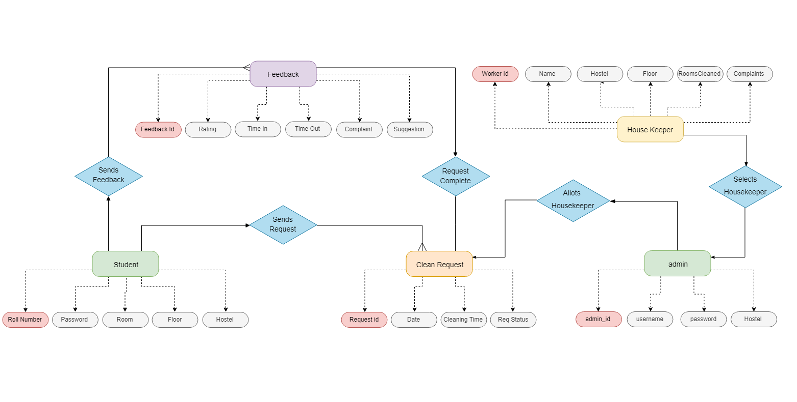
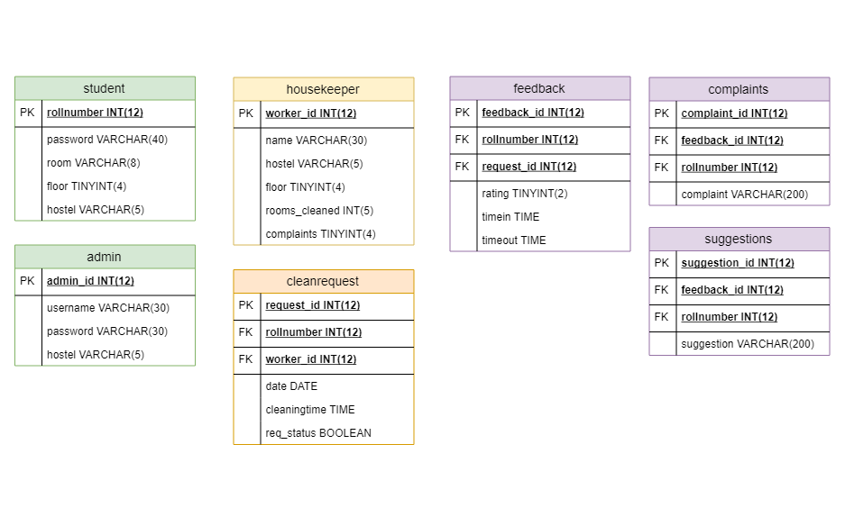

# 🧹 KeepItTidy — Hostel Housekeeping Management System

[](#)
[](#)
[](#)
[](#)
[](#)
[](#)

**KeepItTidy** is a full-stack web application that streamlines hostel room cleaning services. It allows students to schedule room cleaning at their convenience, enables hostel admins to assign housekeepers efficiently, and provides a complete feedback loop — all through a clean, responsive dashboard.


| Role | Credentials |
|---|---|
| Admin | ID: `admin123` / Password: `2305` |
| Student | Roll: `49` / Password: `12345` |

---

## 🖼️ Screenshots

> Student Dashboard · Admin Dashboard · Clean Request · Feedback Form · Complaints & Suggestions


---

## 🎯 Problem Statement

Hostel management struggled to schedule room cleaning efficiently because students have unpredictable and varying class schedules. This led to missed cleans, wasted housekeeper time, and student dissatisfaction.

**KeepItTidy** solves this by letting each student pick their own available time slot for room cleaning — so housekeepers always arrive at the right time.

---

## ✨ Features

### 👨‍🎓 Student Portal
- **Secure Login** — Session-based authentication using roll number and MD5-hashed password
- **Dashboard** — View all past and upcoming cleaning requests with real-time status (Not Alloted / Alloted / Served)
- **Send Clean Request** — Pick a date and preferred time slot for room cleaning
- **Feedback Form** — Rate the housekeeper (1–5 stars), log actual time-in/time-out, and submit complaints or suggestions
- **Header Stats** — Quick stats panel showing total requests, complaints, and suggestions at a glance

### 🔧 Admin Portal
- **Admin Login** — Separate session-based auth for hostel admins
- **Request Management Dashboard** — View all pending and completed cleaning requests for the hostel
- **Allot Housekeeper** — Assign an available housekeeper to any pending request with one click
- **Complaints Record** — Browse all student complaints per housekeeper with star ratings and dates
- **Suggestions Record** — Review student suggestions linked to specific cleaning sessions
- **Worker Management** — Register and manage housekeeper profiles

### 🏗️ System Design
- **ER Diagram** — Entity-Relationship diagram designed from the problem statement
- **Normalized Database Schema** — Tables normalized to reduce redundancy and ensure data integrity
- **Multi-hostel Support** — Admin accounts are scoped to a specific hostel (derived from the username suffix)

---

## 🛠️ Tech Stack

| Layer | Technology |
|---|---|
| Backend | PHP 7.1 |
| Database | MySQL 5.7 |
| Frontend | HTML5, CSS3, JavaScript (ES6) |
| UI Framework | Bootstrap 4.3 |
| Icons | Font Awesome |
| JS Libraries | jQuery, Bootstrap Datepicker |
| Session Management | PHP Sessions |
| Auth | MD5 password hashing + PHP `$_SESSION` |

---

## 📁 Project Structure

```
KeepItTidy/
├── ERDiagram.png               # Entity-Relationship diagram
├── normtable.png               # Normalized database schema diagram
└── source/
    ├── db.php                  # MySQL database connection
    ├── server.php              # Auth handler (student & admin login/logout)
    ├── index.php               # Student dashboard (cleaning request list)
    ├── login.php               # Student login page
    ├── alogin.php              # Admin login page
    ├── allot.php               # Admin dashboard (allot housekeepers)
    ├── allotworker.php         # Housekeeper allotment handler
    ├── request.php             # Student: submit a new clean request
    ├── feedback.php            # Student: submit feedback with rating & timings
    ├── complaints.php          # Admin: view all complaints
    ├── suggestions.php         # Admin: view all suggestions
    ├── profile.php             # Student profile page
    ├── registerstudent.php     # Register a new student
    ├── registerworker.php      # Register a new housekeeper
    ├── studentfunctions.php    # Student-scoped DB query functions
    ├── allotfunctions.php      # Admin-scoped DB query functions
    ├── studenthandler.php      # Handles student form POST actions
    ├── allothandler.php        # Handles admin form POST actions
    ├── sidenav.php             # Student sidebar navigation
    ├── allotsidenav.php        # Admin sidebar navigation
    ├── headerstats.php         # Student stats header (requests, complaints, suggestions)
    ├── allotheader.php         # Admin stats header
    ├── meta.php                # Shared HTML <head> meta/CSS includes
    ├── errors.php              # Error display helper
    └── assets/                 # CSS, JS, vendor libraries (Bootstrap, jQuery, Argon)
```

---

## 🗄️ Database Design

### ER Diagram



### Normalized Schema



### Key Tables

| Table | Description |
|---|---|
| `student` | Student info: roll number, name, room, hostel, hashed password |
| `housekeeper` | Housekeeper info: worker ID, name |
| `admin` | Admin credentials scoped to a hostel |
| `cleanrequest` | Cleaning requests: roll, worker, date, time, status (0=pending / 1=alloted / 2=served) |
| `feedback` | Post-clean feedback: request ID, rating, time-in, time-out |
| `complaints` | Complaints linked to a feedback entry |
| `suggestions` | Suggestions linked to a feedback entry |

---

## 🔄 Application Flow

```
Student logs in
    └─→ Submits a clean request (date + preferred time)
            └─→ Admin sees pending request on dashboard
                    └─→ Admin allots a housekeeper
                            └─→ Housekeeper cleans the room
                                    └─→ Student submits feedback
                                            ├─→ Rating (1–5 stars)
                                            ├─→ Time In / Time Out
                                            ├─→ Complaint (optional)
                                            └─→ Suggestion (optional)
                                                    └─→ Admin reviews complaints & suggestions
```

---

## 🚀 Getting Started

### Prerequisites

- PHP 7.1+
- MySQL 5.7+
- A local server like **XAMPP**, **WAMP**, or **LAMP**

### Installation

1. **Clone the repository:**
   ```bash
   git clone https://github.com/harshalsakhare2305/KeepItTidy.git
   ```

2. **Move source files to your server's web root:**
   ```bash
   # For XAMPP:
   cp -r KeepItTidy/source/ /xampp/htdocs/keepittidy/
   ```

3. **Create the MySQL database:**
   - Open phpMyAdmin or any MySQL client
   - Create a database named `housekeeping`
   - Import the SQL schema (create tables for `student`, `housekeeper`, `admin`, `cleanrequest`, `feedback`, `complaints`, `suggestions`)

4. **Configure the database connection** in `source/db.php`:
   ```php
   $dbhost = "localhost";
   $dbuser = "root";
   $dbpass = "your_password";
   $dbname = "housekeeping";
   ```

5. **Start your local server** and open:
   ```
   http://localhost/keepittidy/login.php       # Student login
   http://localhost/keepittidy/alogin.php      # Admin login
   ```

---

## 📄 License

This project is open source and available under the [MIT License](LICENSE).
